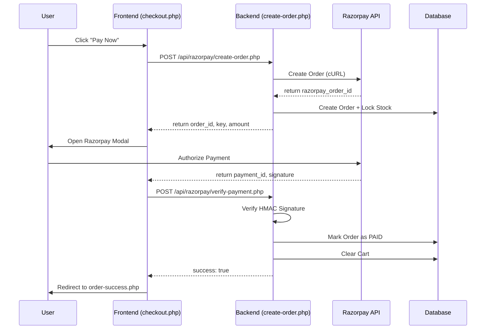

# Razorpay Payment Integration Guide - Sweets Website

This document provides a comprehensive overview of the Razorpay payment integration in the Sweets Website project. It covers the architectural flow, configuration, implementation details, and security measures.

## 1. Architectural Overview

The integration follows a standard secure payment flow:

1.  **Frontend Initialization**: The user clicks "Pay Now" on the checkout page.
2.  **Order Creation (Server-side)**: The frontend calls the backend API to create a Razorpay order and a corresponding database order with stock locking.
3.  **Razorpay Checkout**: The Razorpay modal opens, allowing the user to make a payment.
4.  **Payment Verification (Server-side)**: After successful payment, the frontend sends the payment details to the backend for signature verification and order status update.
5.  **Completion**: The user is redirected to a success page.



---

## 2. Configuration

### Environment Variables (`.env`)
The Razorpay credentials are stored in the `.env` file in the project root:

```env
# Payment Gateway (Razorpay)
RAZORPAY_KEY=rzp_test_...
RAZORPAY_SECRET=...
```

---

## 3. Implementation Details

### A. Frontend: `checkout.php` & `checkout-razorpay.js`

- **Checkout Page**: Includes the Razorpay script and custom integration script.
  ```html
  <script src="https://checkout.razorpay.com/v1/checkout.js"></script>
  <script src="assets/js/pages/checkout-razorpay.js"></script>
  ```
- **JS Logic (`checkout-razorpay.js`)**:
    - Validates the checkout form.
    - Sends form data to `api/razorpay/create-order.php`.
    - Initializes `Razorpay` object with the returned `order_id`.
    - Handles the `handler` callback to verify payment via `api/razorpay/verify-payment.php`.

### B. Backend: `PaymentService.php`

The `PaymentService` class handles direct communication with the Razorpay API:

- `createRazorpayOrder(array $cartData)`: Makes a cURL request to `/v1/orders` to get a `razorpay_order_id`.
- `verifyRazorpaySignature(...)`: Re-calculates the HMAC signature using the `RAZORPAY_SECRET` to ensure the payment response is authentic.

### C. API Endpoints

1.  **`api/razorpay/create-order.php`**:
    - Calculates totals and discounts.
    - Calls `PaymentService->createRazorpayOrder()`.
    - Calls `OrderRepository->createWithStockLock()` to ensure products are reserved before payment.
2.  **`api/razorpay/verify-payment.php`**:
    - Verifies the payment signature.
    - Updates order status to `paid`.
    - Saves the shipping address to the database.
    - Clears the user's cart.

---

## 4. Security & Robustness

### Signature Verification
To prevent "fake success" attacks, every payment is verified on the server side using the HMAC-SHA256 algorithm:
```php
$expectedSignature = hash_hmac('sha256', $orderId . '|' . $paymentId, $keySecret);
return hash_equals($expectedSignature, $signature);
```

### Atomic Transactions (Stock Locking)
The system uses `createWithStockLock` in `OrderRepository`. This method initiates a database transaction and checks stock levels before the user even pays, preventing overselling.

---

## 5. Testing

To test the integration:
1.  Ensure `APP_ENV=development` in `.env`.
2.  Use the **Razorpay Test Cards** (e.g., 4111 1111 1111 1111).

## 6. Files Involved
- `checkout.php`: Main entry point.
- `assets/js/pages/checkout-razorpay.js`: Frontend logic.
- `api/razorpay/create-order.php`: Order initialization.
- `api/razorpay/verify-payment.php`: Order finalization.
- `services/PaymentService.php`: Gateway communication logic.
- `repositories/OrderRepository.php`: Database operations.
